  

  
  
  
  

 

## whoami

I read Industrial & Systems Engineering at **IIT Kharagpur**, class of 2028, and I spend most of
my time where statistics meets markets: forecasting, factor research, optimisation, and the
occasional 3 a.m. contest problem. Right now I am working through stochastic calculus,
econometrics, and market microstructure.

I advise the **Kharagpur Data Analytics Group**, having run it as Executive Head the year before.

> कर्मण्येवाधिकारस्ते मा फलेषु कदाचन ।
> मा कर्मफलहेतुर्भूर्मा ते सङ्गोऽस्त्वकर्मणि ॥
>
> *You have a right to the work alone, never to its fruits.*

## track record

  

<b>the same thing, with the detail filled in</b>

 

| when | where | what |
|:-----|:------|:-----|
| **2026-27** | **KDAG**, IIT Kharagpur | **Advisor** to the Kharagpur Data Analytics Group, steering curriculum and project direction. |
| **2025-26** | **KDAG**, IIT Kharagpur | **Executive Head**, running the data science curriculum, projects and inductions under the Technology Students' Gymkhana. |
| **May to Jul 2025** | **PharmEasy** *(Threpsi Solutions)* | Summer intern in Bangalore, a ten week project engagement. |
| **Sep to Oct 2024** | **Myntra** | **Strategy Intern**. Market and competitive analysis for a shoe care brand launch, covering pricing, positioning, product portfolio and the go to market plan. |
| **Jul to Nov 2024** | **Seventh Triangle Consulting** | **Research & Development Intern**, four months of applied research and analysis. |
| | **WorldQuant** | **Gold Level**, WorldQuant Challenge. |

## allocation

  

## positions

  

## a day at the desk

  

## selected work

| repo | what it is | stack |
|:-----|:-----------|:------|
| [**Quantitative-Finance**](https://github.com/Madmins07/Quantitative-Finance) | Stock predictor and trend plotter, price forecasting with signal visualisation. | Python |
| [**OR2**](https://github.com/Madmins07/OR2) | Operations research models and solvers, straight from the ISE side of the house. | Python |
| [**Time-series-models**](https://github.com/Madmins07/Time-series-models) | The ARIMA family and friends, as forecasting notebooks. | Jupyter |
| [**Neural_Networks**](https://github.com/Madmins07/Neural_Networks) | Networks built from scratch first, then rebuilt with the frameworks. | Jupyter |
| [**Competitive-Programming**](https://github.com/Madmins07/Competitive-Programming) | Contest solutions and templates. | C++ |
| [**cgpa_simulator**](https://github.com/Madmins07/cgpa_simulator) | A small tool for the eternal Kharagpur question: *what do I need this semester?* | JavaScript |

  <a href="https://github.com/Madmins07?tab=repositories"><b>all repositories</b></a>

## now playing

  

## contributions

  <picture>
    <source media="(prefers-color-scheme: dark)" srcset="https://raw.githubusercontent.com/Madmins07/Madmins07/output/github-snake-dark.svg"/>
    <source media="(prefers-color-scheme: light)" srcset="https://raw.githubusercontent.com/Madmins07/Madmins07/output/github-snake.svg"/>
    
  </picture>

## elsewhere

 

  

