<div align="center">
  
</div>

<div align="center">
  
  
  
  
</div>

<br/>

## `$ whoami`

```text
NAME     Madhav Agarwal
SCHOOL   IIT Kharagpur · Industrial & Systems Engineering · Class of 2027
ROLE     Executive Head, Kharagpur Data Analytics Group (KDAG) · 2025-26
BASE     Kolkata, India
FOCUS    quantitative finance · machine learning · time-series · operations research
WRITING  madblogs6.wordpress.com

MOTD     कर्मण्येवाधिकारस्ते मा फलेषु कदाचन ।
         मा कर्मफलहेतुर्भूर्मा ते सङ्गोऽस्त्वकर्मणि ॥
         — you have a right to the work alone, never to its fruits.
```

I study industrial & systems engineering and spend most of my time where statistics meets
markets: forecasting, factor research, optimisation, and the occasional 3 a.m. contest problem.
Currently going deeper on stochastic calculus, econometrics, and market microstructure.

## `$ track-record`

| WHEN | WHERE | WHAT |
|:-----|:------|:-----|
| **2025–26** | **KDAG**, IIT Kharagpur | **Executive Head** of the Kharagpur Data Analytics Group — running the data-science curriculum, projects and inductions under the Technology Students' Gymkhana. |
| **May–Jul 2025** | **PharmEasy** *(Threpsi Solutions)* | Summer intern, Bangalore — a ten-week project engagement. |
| **Sep–Oct 2024** | **Myntra** | **Strategy Intern** — market and competitive analysis for a shoe-care brand launch; pricing, positioning, product portfolio and the go-to-market plan. |
| **Jul–Nov 2024** | **Seventh Triangle Consulting** | **Research & Development Intern** — four months of applied research and analysis work. |
| — | **WorldQuant** | **Gold Level**, WorldQuant Challenge. |

## `$ allocation --skills`

<div align="center">
  
</div>

<div align="center">

`Python` · `C++` · `PyTorch` · `TensorFlow` · `scikit-learn` · `pandas` · `NumPy` · `statsmodels` · `SQL` · `Git`

</div>

## `$ repositories --notable`

| REPO | WHAT IT IS | STACK |
|:-----|:-----------|:------|
| [**Quantitative-Finance**](https://github.com/Madmins07/Quantitative-Finance) | Stock predictor and trend plotter — price forecasting and signal visualisation. | Python |
| [**OR2**](https://github.com/Madmins07/OR2) | Operations-research models and solvers from the ISE side of the house. | Python |
| [**Time-series-models**](https://github.com/Madmins07/Time-series-models) | ARIMA-family and friends — forecasting notebooks and experiments. | Jupyter |
| [**Neural_Networks**](https://github.com/Madmins07/Neural_Networks) | Networks built from the ground up, then rebuilt with the frameworks. | Jupyter |
| [**Competitive-Programming**](https://github.com/Madmins07/Competitive-Programming) | Contest solutions and templates. | C++ |
| [**cgpa_simulator**](https://github.com/Madmins07/cgpa_simulator) | A small tool for the eternal KGP question: *what do I need this semester?* | JavaScript |

<div align="center">
  <a href="https://github.com/Madmins07?tab=repositories"><b>… see all repositories →</b></a>
</div>

## `$ contributions --replay`

<div align="center">
  <picture>
    <source media="(prefers-color-scheme: dark)" srcset="https://raw.githubusercontent.com/Madmins07/Madmins07/output/github-snake-dark.svg"/>
    <source media="(prefers-color-scheme: light)" srcset="https://raw.githubusercontent.com/Madmins07/Madmins07/output/github-snake.svg"/>
    
  </picture>
</div>

## `$ contact`

<div align="center">

[](https://www.linkedin.com/in/madhav-agarwal07/)
[](mailto:madhavagarwal50@gmail.com)
[](https://madblogs6.wordpress.com)
[](https://codeforces.com/profile/madmins07)
[](https://x.com/MadhavA77048446)

</div>

<details>
<summary align="center"><b>▶ off-desk hours</b></summary>
<br/>
<div align="center">

Off the desk: calm synths, K-pop and EDM — whatever keeps the compiler running.

<a href="https://open.spotify.com/user/31rvfbish5mkv7mhyb6u7syx65gy"></a>
<a href="https://www.instagram.com/madhav_agarwal04/"></a>
<a href="https://www.youtube.com/channel/UCFmXA9SDImYXYxI5nT2w5Yg"></a>

</div>
</details>

<br/>

<div align="center">
  
</div>
