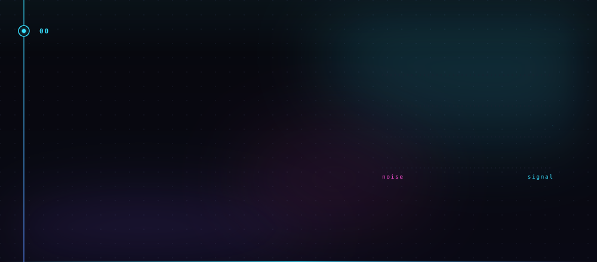
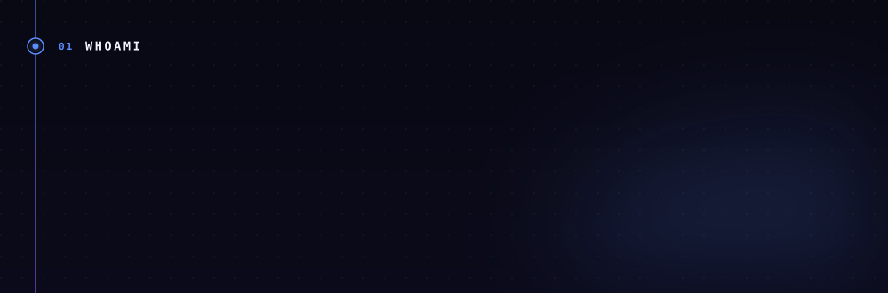
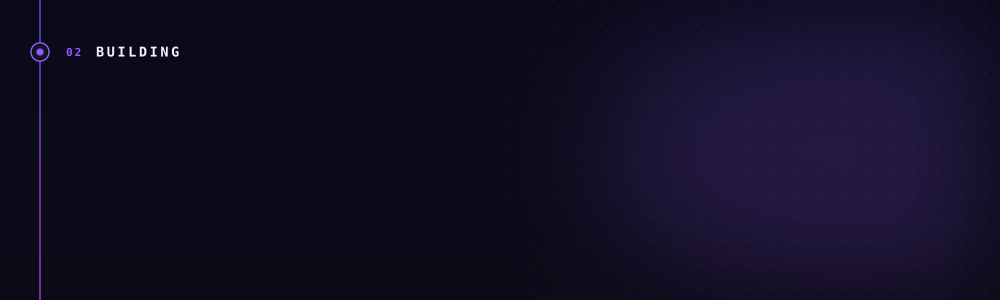
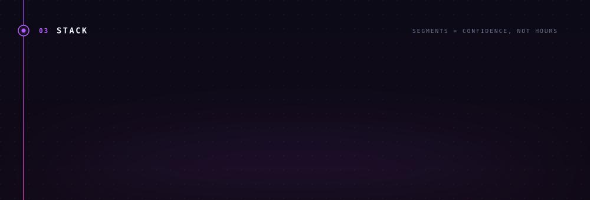
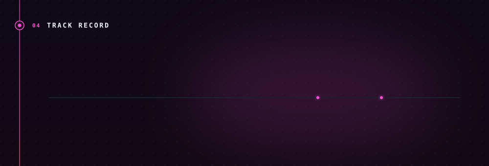
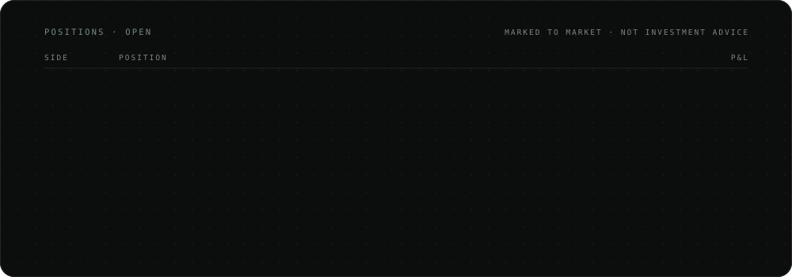
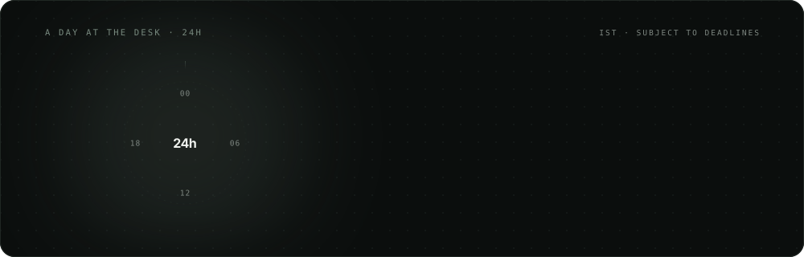
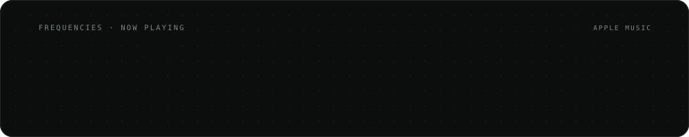
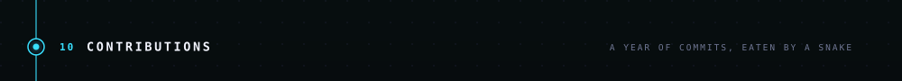
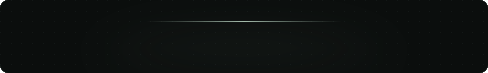

<a href="https://amoh.ai">amoh.ai</a> · <a href="https://github.com/amoh-ai">@amoh-ai</a> · <a href="mailto:research@amoh.ai">research@amoh.ai</a> · <a href="https://amoh.ai/about.html#careers">we are hiring</a>

<a href="https://github.com/Madmins07/cgpa_simulator">cgpa_simulator</a> · <a href="https://github.com/Madmins07/OR2">OR2</a> · <a href="https://github.com/Madmins07/Time-series-models">Time-series-models</a> · <a href="https://github.com/Madmins07/Competitive-Programming">Competitive-Programming</a> · <a href="https://github.com/Madmins07/KDAG_Core_Tasks">KDAG_Core_Tasks</a> · <a href="https://github.com/Madmins07/Quantitative-Finance">Quantitative-Finance</a> · <a href="https://github.com/Madmins07?tab=repositories">all repositories</a>

<picture><source media="(prefers-color-scheme: dark)" srcset="https://raw.githubusercontent.com/Madmins07/Madmins07/output/github-snake-dark.svg"/><source media="(prefers-color-scheme: light)" srcset="https://raw.githubusercontent.com/Madmins07/Madmins07/output/github-snake.svg"/></picture>

